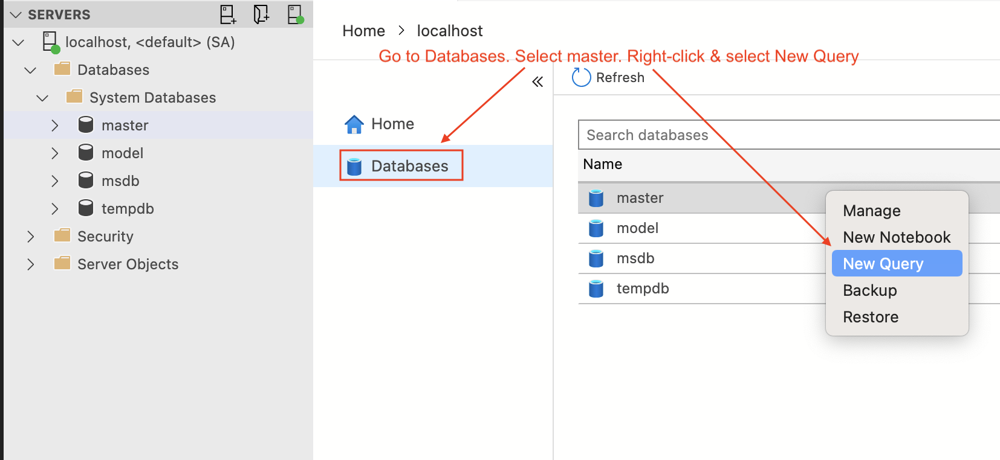
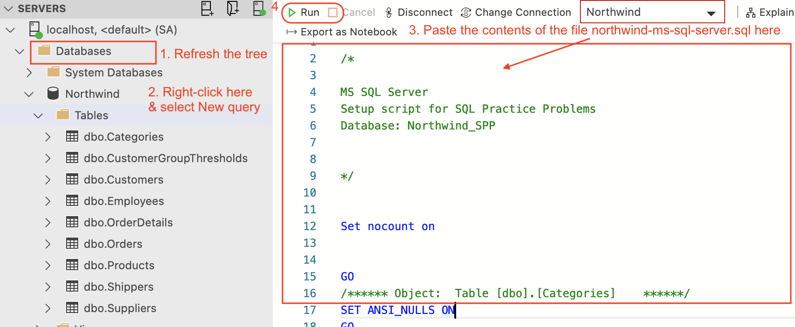

# Northwind MySQL
MySQL version of Northwind database used in the book [SQL Practice Problems](https://www.amazon.com/SQL-Practice-Problems-learn-doing/dp/1520807635) Book.

```text
Edition: Kindle
Publication date: November 16, 2016
ASIN: B01N41VQFO
```

## Why did I create this?
The original scripts shipped with the **Kindle edition** of the book I bought off Amazon was compatible with only 
Windows/SQL Server. I reverse-engineered the scripts to make it work on my Mac/MySQL.

## Setting up on Mac and MySQL

1. Login to MySQL
```mysql
$ mysql -h localhost -P 3306 --protocol=tcp -u root -p
```

2. Re-create database
```mysql
mysql> drop database if exists Northwind;
```

```mysql
mysql> create database Northwind;
```

3. Import northwind.sql

```mysql
mysql> source [/path/to/]northwind-mysql.sql
```

## Setting up on Mac and Microsoft SQL Server

1. Install [Docker Desktop for Mac](https://hub.docker.com/editions/community/docker-ce-desktop-mac/)

2. Start MS SQL Server as a Docker container
```
$ docker run -e 'ACCEPT_EULA=Y' -e 'SA_PASSWORD=@dmin!234' -p 1433:1433 --name mssql -h mssql -d mcr.microsoft.com/mssql/server
```

3. Note the credentials. User ID is `SA`. Password is `@dmin!234`

4. Install [Azure Data Studio for Mac](https://docs.microsoft.com/en-us/sql/azure-data-studio/download-azure-data-studio)

5. Login to Azure Data Studio and follow the steps in the following screenshots:
    - Go to Databases -> master -> right-click -> New query and run the following command:
      ```
      CREATE DATABASE Northwind
      ```
      
      
    - Refresh the tree on the left, find Northwind under Databases -> right-click -> New query and run the contents of the file northwind-ms-sql-server.sql:
      
    